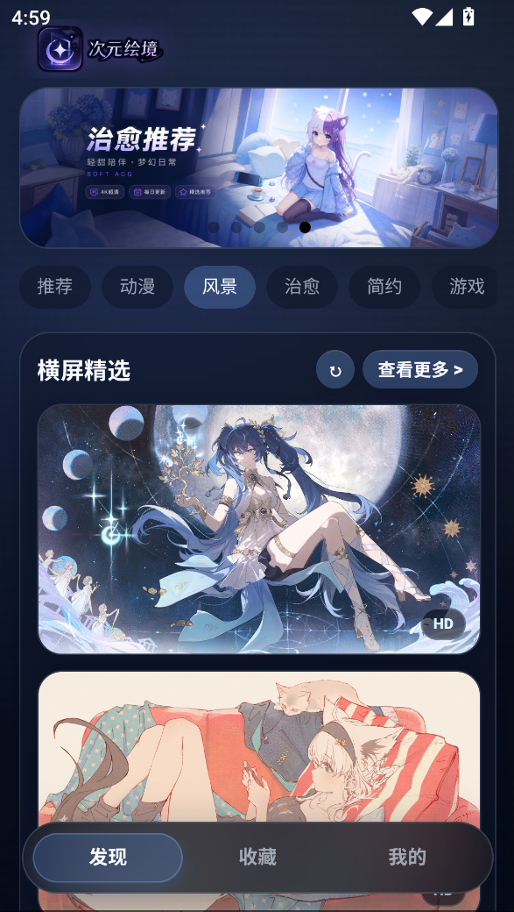

# 次元绘境 / Dimension Gallery

基于 UniApp、Vue 3 和 JavaScript 的移动端壁纸应用，面向 H5 和 App 打包。应用提供横屏/竖屏壁纸浏览、分类列表、图片预览、收藏、历史记录和本地设置。

> 图片来自公开第三方 API，仅用于学习和展示。版权归原作者或来源站点所有。

## 预览



## 功能

- 首页分类浏览：推荐、动漫、风景、治愈、简约、游戏、AI。
- 横屏和竖屏分区展示，首页支持刷新和查看更多。
- 风景横屏列表使用满宽展示，首页风景区使用竖向满宽卡片。
- 点击首页图片可在应用内放大预览。
- 支持收藏、历史记录和基础设置，数据保存在本地。
- 支持 H5 预览和 App 资源构建。

## 技术栈

- UniApp
- Vue 3
- JavaScript
- Vite
- 原生 CSS

## 数据来源

当前接入的公开图片源：

- Alcy: `https://t.alcy.cc`
- 夜轻: `https://api.yppp.net`
- Elaina 横屏: `https://api.elaina.cat/random/pc`
- Elaina 竖屏: `https://api.elaina.cat/random/mobile`
- Moehu: `https://img.moehu.org`
- Yaohud R18: `https://acg.yaohud.cn/R18/setu.php`
- Yaohud AI R18: `https://acg.yaohud.cn/dm/r18.php`

首页横屏会在推荐、动漫、风景、治愈、简约、更多中混入 Elaina PC。首页竖屏会在推荐、动漫、治愈、简约、更多中混入 Elaina Mobile。游戏分类单独使用 Moehu 的 `ys` 和 `mrfz` 图源。

项目不使用 axios，不调用写入类接口。部分随机图片接口会追加时间参数避免缓存。

## 本地运行

安装依赖：

```bash
npm install
```

运行 H5：

```bash
npm run dev:h5
```

构建 H5：

```bash
npm run build:h5
```

构建 App 资源：

```bash
npm run build:app-plus
```

## APK 打包

1. 使用 HBuilderX 打开项目目录。
2. 检查 `src/manifest.json` 中的 AppID、包名和版本号。
3. 选择 `发行 -> App-Android/iOS-云打包`。
4. 选择 Android APK。
5. 使用云端证书或正式证书打包。

构建产物通常位于：

```txt
dist/
unpackage/
```

## 目录结构

```txt
src/
  api/          图片接口适配
  components/   通用组件
  composables/  收藏、历史、设置等状态逻辑
  pages/        UniApp 页面
  static/       静态资源
  utils/        缓存、平台、存储工具
```

## 项目信息

- 应用名：次元绘境 / Dimension Gallery
- 包名：`com.dimension.gallery`
- AppID：`__UNI__38A3BD1`
- 当前版本：`0.2.0`

## 注意事项

- 第三方 API 的稳定性、速度和可用性不由本项目保证。
- 收藏、历史和设置只保存在本机，不支持账号同步。
- 跨域图片保存可能受平台或来源站限制。
- 正式发布前建议替换正式图标，并使用正式签名证书。

## 许可证

本项目基于 [MIT License](LICENSE) 开源。
